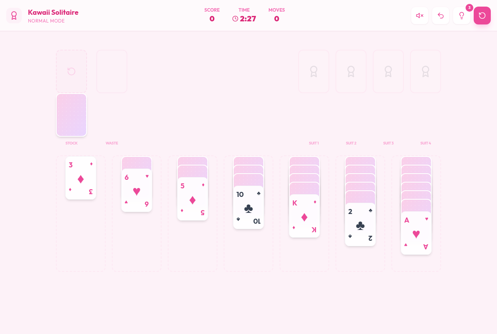

# Kawaii & Elegant Solitaire 🎀✨


パステルカラーと心地よいアニメーションを融合させた、究極に「Kawaii」ソリティアゲームです。  
最新のWeb技術を駆使し、滑らかな操作性と安定したゲームプレイを提供します。

## 🎮 今すぐ遊ぶ（ライブデモ）

<p align="center">
  <a href="https://sawahotaru.github.io/kawaii-elegant-solitaire/">
    
  </a>
</p>

### 🎮 ▶ [今すぐ遊ぶ（ライブデモ）](https://sawahotaru.github.io/kawaii-elegant-solitaire/)

> サーバー不要・インストール不要。ブラウザで今すぐプレイできます 🌸
> `main` ブランチへ push するたびに GitHub Actions が自動でビルド＆デプロイします。



---

## 🌟 主な特徴

- **Design**: 洗練されたパステルピンクの配色とグラスモーフィズムUI、レスポンシブ対応（スマホ最適化）
- **Difficulty**: 3段階の難易度（初心者 / 中級 / 上級）。**初心者・中級は「必ずクリアできる盤面」のみを出題**（内蔵ソルバーが可解性を判定）。上級は純ランダムの挑戦モード
- **Assist**: ヒント（回数は設定で選択可）、やり直し（Undo）、**一括あがり（オートコンプリート）**、**初心者限定のカード入れ替え（ズル）**
- **Experience**: `dnd-kit` によるストレスのないドラッグ＆ドロップと、ダブルクリックでの自動移動
- **Animation**: `Framer Motion` による弾むようなカードの動きと、勝利時のファンファーレ＋華やかな紙吹雪演出

## 🛠 使用技術

- **Core**: React 18, TypeScript, Vite
- **Styling**: Tailwind CSS
- **Interaction**: dnd-kit
- **Animation**: Framer Motion（カードの動き、勝利時の紙吹雪演出）
- **Audio**: Web Audio API（BGM・効果音・勝利ファンファーレ。既定はミュート）
- **Icons**: Lucide React

---

## 🎯 難易度とアシスト機能

### 難易度（ヘッダーで切替・選択は自動保存）

| 難易度 | 配り | めくり | Undo | ヒント既定 | 特徴 |
|---|---|---|---|---|---|
| 初心者 | 必ず解ける（やさしい）盤面 | 1枚 | 無制限 | 無制限 | **カード入れ替え（ズル）**が使える |
| 中級 | 必ず解ける盤面 | 1枚 | たっぷり | 3回 | 標準的な歯ごたえ |
| 上級 | 純ランダム（解けない局もあり） | 3枚 | 少なめ | 1回 | 挑戦モード |

> 「必ず解ける盤面」は、内蔵ソルバー（[`src/utils/solver.ts`](src/utils/solver.ts)）が配布時に**実際に勝ち筋を探索**し、解けた盤面のみを採用することで実現しています。これにより初心者・中級では「理不尽な詰み」を回避できます。色の偏り等はあくまで正しい一様シャッフルの結果で、難易度操作はありません。

### アシスト

- **ヒント上限の設定**: ヘッダーで `自動 / 3 / 5 / 10 / ∞` を選択（全難易度に適用・自動保存）。`自動` は難易度準拠
- **一括あがり**: すべてのカードが表向きになると「✨ 一括あがり」ボタンが出現。残りを自動で組札へ送ってクリアします
- **カード入れ替え（ズル・初心者限定）**: 🪄ボタン → 盤面の表向きカードをタップ → 欲しいカードを選ぶと2枚を入れ替え（組札のカードは対象外、Undoで取り消し可）
- **BGM / 効果音**: 既定はミュート。ヘッダーのスピーカーアイコンでオン（クリア時はファンファーレ）

---

## 🚀 環境構築 (Local Setup)

### 1. 前提条件
- **Node.js**: v18.0.0 以上推奨

### 2. インストール
リポジトリをクローンし、ディレクトリ内で以下のコマンドを実行します。

```bash
git clone https://github.com/sawahotaru/kawaii-elegant-solitaire.git
cd kawaii-elegant-solitaire
npm install
```

> ⚠️ **フォルダ名に関する注意**: プロジェクトを置くパスに `&` などのシェル特殊文字が含まれていると、`npm run dev` / `npm run build` がパス解決に失敗することがあります（特に Windows / PowerShell）。`&` を含まないフォルダ名（例: `kawaii-elegant-solitaire`）に配置してください。

### 3. 開発サーバーの起動
ローカルで動作を確認するには、以下のコマンドを実行して `http://localhost:5173` にアクセスします。

```bash
npm run dev
```

---

## 🏗 本格運用・ビルド (Production Build)

本番環境用に最適化されたファイルを生成するには、以下の手順を実行します。

### 1. ビルドの実行
```bash
npm run build
```
実行後、プロジェクトルートに `dist` フォルダが生成されます。

### 2. デプロイ

**A. GitHub Pages（自動・推奨／無料・サーバー不要）**
本リポジトリには `.github/workflows/deploy.yml` が含まれており、`main` ブランチへの push で自動的にビルド＆公開されます。初回のみ以下を設定してください：

1. GitHub にリポジトリを作成して push
2. リポジトリの **Settings → Pages → Build and deployment → Source** を **GitHub Actions** に変更
3. 以後 push するたびに `https://sawahotaru.github.io/kawaii-elegant-solitaire/` が自動更新されます

**B. その他のホスティング（Vercel / Netlify / Cloudflare Pages など）**
いずれも無料枠で利用できます。ビルド設定は `Build command: npm run build` / `Output directory: dist` を指定するだけです。手動の場合は `npm run build` で生成された `dist` フォルダをアップロードします。

---

## 📂 プロジェクト構造 (Brief)

- `src/components/`: UIコンポーネント（カード、パイル、紙吹雪など）
- `src/hooks/`: ゲームロジックを管理するカスタムフック (`useGameState.ts`)
- `src/utils/`: 純粋なロジック関数（シャッフル、ルール判定、可解判定ソルバー `solver.ts`、効果音 `audio.ts`）
- `src/types/`: TypeScriptの型定義

---

## 📝 開発の記録
詳細な開発の経緯やバグ修正の履歴については、[DEVELOPMENT_LOG.md](./DEVELOPMENT_LOG.md) を参照してください。

---

## 🤝 コントリビュート
Issue や Pull Request を歓迎します。バグ報告・機能提案はお気軽にどうぞ。

## 📄 ライセンス
本プロジェクトは [MIT License](./LICENSE) のもとで公開されています。商用・改変・再配布を含め、自由にご利用いただけます。

---

Enjoy your Kawaii Solitaire! 🌸🎮
